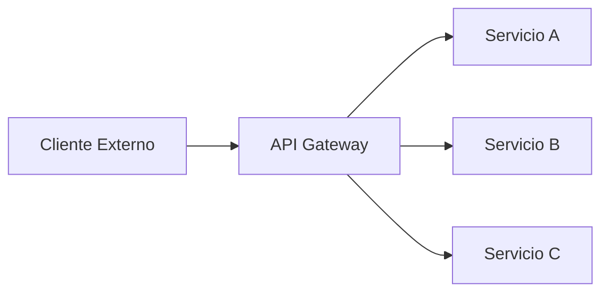
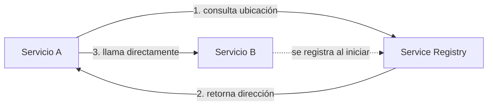
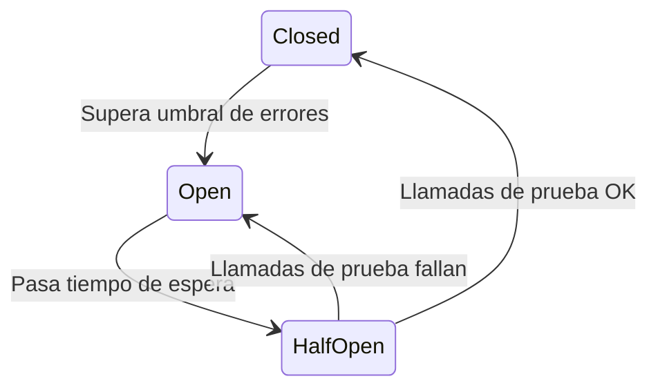
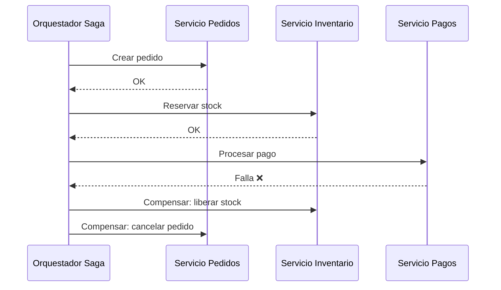

# Arquitectura y Patrones de Diseño

Este documento describe los patrones arquitectónicos que todo microservicio de este sistema debe seguir.

## 🚪 API Gateway

Todo el tráfico externo (fuera del clúster/red interna) entra a través de un **único punto de entrada**: el API Gateway.

**Responsabilidades del Gateway:**
- Enrutamiento de requests hacia el microservicio correspondiente
- Autenticación/autorización centralizada (validación de tokens)
- Rate limiting
- Agregación de respuestas cuando un endpoint compone datos de varios servicios

**Regla**: ningún microservicio debe exponerse directamente a clientes externos sin pasar por el Gateway.

## 🔍 Service Discovery

Los microservicios no se comunican entre sí usando IPs o hostnames fijos — usan un mecanismo de **descubrimiento de servicios** para localizarse dinámicamente, dado que las instancias escalan, se reinician y cambian de dirección constantemente.

**Por qué importa**: permite escalar instancias de un servicio sin reconfigurar manualmente a quienes lo consumen.

## 🔌 Circuit Breaker

Cuando un servicio del que dependemos empieza a fallar o responde con latencia excesiva, **no debemos seguir insistiendo indefinidamente** — eso puede propagar el fallo en cascada a todo el sistema.

**Estados del Circuit Breaker:**

| Estado | Comportamiento |
|---|---|
| **Closed** (cerrado) | Tráfico fluye normalmente hacia el servicio |
| **Open** (abierto) | Las llamadas fallan rápido (fail-fast), sin intentar llegar al servicio caído |
| **Half-Open** (semi-abierto) | Se permiten algunas llamadas de prueba para verificar si el servicio se recuperó |

!!! warning "Importante"
    Todo servicio que llame a otro servicio síncrono debe implementar Circuit Breaker. No hacerlo expone al sistema completo a fallos en cascada ante la caída de una sola dependencia.

## 🔄 Saga Pattern

Para operaciones de negocio que requieren coordinar cambios en **múltiples servicios** (y por lo tanto múltiples bases de datos), no usamos transacciones distribuidas tradicionales — usamos el patrón **Saga**: una secuencia de transacciones locales, donde cada paso publica un resultado que dispara el siguiente paso, y si algo falla, se ejecutan **transacciones de compensación** para revertir lo ya hecho.

**Cuándo usar Saga vs. transacción simple**: si tu operación toca un solo servicio/base de datos, no necesitas Saga — una transacción local basta. Solo aplica cuando la operación de negocio cruza límites de servicio.

## 📐 Principios generales

- Cada microservicio es dueño de sus propios datos (**Database per Service**) — ningún otro servicio accede directamente a la base de datos de otro
- Toda comunicación entre servicios usa contratos versionados (ver convenciones en [Stack Tecnológico](stack-tecnologico.md))
- Los timeouts son obligatorios en toda llamada saliente — nunca esperar indefinidamente una respuesta